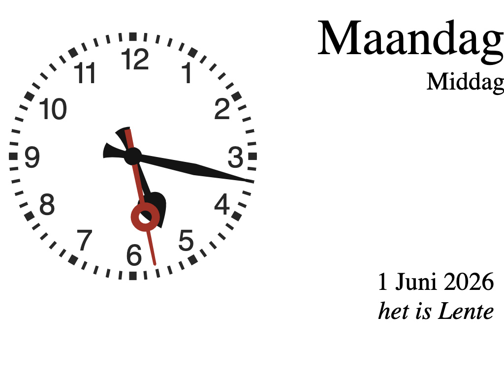

# klok.info

Een eenvoudige webklok met dag, dagdeel, datum en seizoen — bedoeld voor
(licht dementerende) ouderen om basale tijd- en datuminformatie altijd
zichtbaar te hebben, bijvoorbeeld op een oude iPad die als beeldschermpje
op de buffetkast staat.

## Installeren als app op iPad

1. Open https://klok.info in Safari.
2. Tik op het deelmenu → "Voeg toe aan beginscherm".
3. De klok start nu fullscreen vanaf het beginscherm, zonder Safari-balk.

## Techniek

- Statische HTML, geen server-side logica — dag/datum/seizoen worden
  client-side berekend uit de klok van het apparaat zelf.
- SVG analoge klok van [3quarks.com](http://www.3quarks.com/en/SVGClock/).
- PWA: `manifest.json` voor moderne browsers, Apple meta tags voor
  oudere iPads, en een service worker (`sw.js`) voor offline gebruik.
